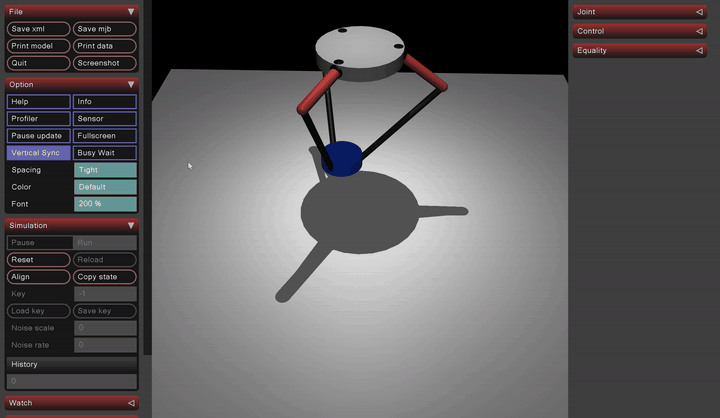
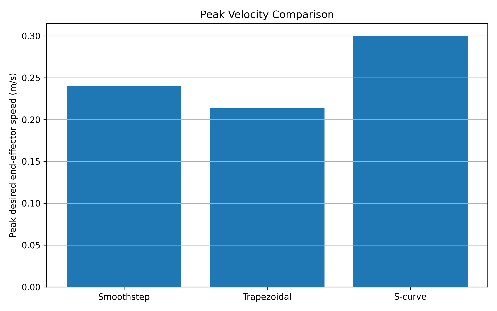
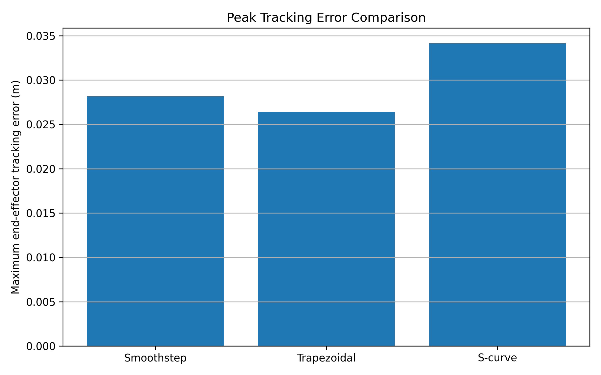

# Delta Robot Pick-and-Place Simulation in MuJoCo

A simulation study of a simplified closed-chain delta robot performing repeated pick-and-place motion in MuJoCo. The project implements inverse kinematics, joint-space PD control, trajectory tracking, cycle-time analysis, and a comparison of smoothstep, trapezoidal, and S-curve motion profiles.

The robot model is inspired by the general structure of the ABB IRB 360 FlexPicker, but it is not intended to be an exact reproduction of the commercial robot.

## Results Preview

### MuJoCo Simulation Demo



### Trajectory Profile Velocity Comparison



### End-Effector Tracking Error Comparison



## Authors

- Frank Zhang
- DeZhao Yu

## Key Features

- Closed-chain delta robot model defined in MuJoCo XML
- Cartesian pick-and-place trajectory generation
- Inverse kinematics with a fast local solver and fallback search
- Joint-space PD torque control for three actuated motors
- Timing sweep analysis of cycle time, actuator torque, and tracking error
- Comparison of smoothstep, trapezoidal, and S-curve trajectory profiles
- Automatic CSV data logging and performance plot generation

## Requirements

This repository has been tested and verified with Python 3.11. Use Python 3.11 to reproduce the documented simulation results.

- Python 3.11
- MuJoCo 3.6.0
- NumPy 2.4.3
- Matplotlib 3.10.9

## Installation

Install the required packages using Python 3.11:

```bash
py -3.11 -m pip install -r requirements.txt
```

## Running the Baseline Simulation

Run the baseline smoothstep pick-and-place simulation:

```bash
py -3.11 test_mujoco_baseline.py
```

The program precomputes the Cartesian trajectory and inverse-kinematics solutions, opens the MuJoCo viewer, and replays the simulated motion. Close the viewer window to save the CSV log and result plots.

## Running the Trajectory Comparison

Compare smoothstep, trapezoidal, and S-curve trajectory profiles:

```bash
py -3.11 test_mujoco_trajectory.py
```

The script runs the same pick-and-place task for all three profiles and compares peak velocity, acceleration, actuator torque, tracking error, and estimated torque-limited cycle time. Results are saved in:

- `smoothstep/`
- `trapezoidal/`
- `S_curve/`
- `trajectory_comparison/`

## Running the Timing Sweep

Run the smoothstep timing sweep:

```bash
py -3.11 test_mujoco_timing_sweep.py
```

The script keeps the Cartesian path and smoothstep trajectory profile fixed while reducing the cycle time. It measures how execution speed affects actuator torque demand and end-effector tracking error.

Results are saved in:

- `timing_sweep_results/`

> The commands in this README use the Windows Python launcher. On another operating system, replace `py -3.11` with the appropriate command for Python 3.11.

## Project Structure

```text
delta-robot-mujoco/
├── delta_closed.xml
├── test_mujoco_baseline.py
├── test_mujoco_timing_sweep.py
├── test_mujoco_trajectory.py
├── requirements.txt
├── README.md
├── smoothstep/
├── trapezoidal/
├── S_curve/
├── timing_sweep_results/
└── trajectory_comparison/
```

### Core Files

- `delta_closed.xml`: MuJoCo model of the simplified closed-chain delta robot
- `test_mujoco_baseline.py`: Baseline smoothstep pick-and-place simulation
- `test_mujoco_timing_sweep.py`: Cycle-time, torque, and tracking-error study
- `test_mujoco_trajectory.py`: Comparison of smoothstep, trapezoidal, and S-curve profiles
- `requirements.txt`: Python package versions used to reproduce the simulation

## Simulation Method

The desired end-effector motion is defined in Cartesian space as an eight-segment pick-and-place task. Each desired platform position is converted into three motor-angle commands through inverse kinematics.

A fast local inverse-kinematics solver uses the previous timestep as its initial estimate. If the local solver does not converge, the program switches to expanding-range and full-range fallback searches.

The desired motor angles are tracked using a joint-space PD torque controller. The three motor torque commands are limited to approximately ±20 N·m. During each simulation, the program records joint motion, end-effector motion, actuator torque, tracking error, and inverse-kinematics residuals.

## Key Results

### Baseline Simulation

The baseline smoothstep simulation completed a 7.0-second pick-and-place cycle with:

- Peak actuator torque demand: approximately 1.246 N·m
- Maximum end-effector tracking error: approximately 0.0282 m
- Maximum inverse-kinematics residual: approximately `1.0e-9` m
- No fallback IK events during the tested trajectory

### Timing Sweep

Reducing the cycle time from 7.0 seconds to 2.1 seconds produced:

- An increase in peak actuator torque from approximately 1.246 N·m to 1.797 N·m
- An increase in maximum 3D tracking error from approximately 0.0282 m to 0.0746 m

The results demonstrate the trade-off between faster operation, actuator effort, and tracking accuracy.

### Trajectory Profile Comparison

For the same 7.0-second pick-and-place task:

| Profile | Peak Torque Demand | Peak Desired End-Effector Speed | Maximum Tracking Error |
|---|---:|---:|---:|
| Smoothstep | 1.2460 N·m | 0.2401 m/s | 0.0282 m |
| Trapezoidal | 1.2363 N·m | 0.2134 m/s | 0.0264 m |
| S-curve | 1.2893 N·m | 0.3001 m/s | 0.0342 m |

In this simulation, the trapezoidal profile produced the lowest peak torque demand and the lowest maximum tracking error. The S-curve profile produced smoother endpoint behavior in theory, but its higher peak speed under the selected segment timing resulted in the largest tracking error of the three tested profiles.

These results apply to this particular model, controller, path, and timing configuration. They should not be interpreted as a general conclusion that one trajectory profile is always superior.

## Assumptions and Limitations

- The model is inspired by the general structure of the ABB IRB 360 FlexPicker but is not an exact reproduction.
- Robot geometry, masses, inertias, joints, and actuator properties are simplified.
- The controller uses joint-space PD torque control rather than an industrial robot controller.
- The simulation does not include detailed gripper behavior, object contact, payload variation, compliance, backlash, motor heating, or hardware calibration.
- The minimum feasible cycle-time study is a simulation-based torque check, not a complete trajectory optimization.
- Numerical results are intended for comparative analysis of this model rather than prediction of commercial robot performance.

## Project Context

This project was completed for AME 547, Foundations for Manufacturing Automation, at the University of Southern California in Spring 2026.

The project was developed collaboratively by Frank Zhang and DeZhao Yu.